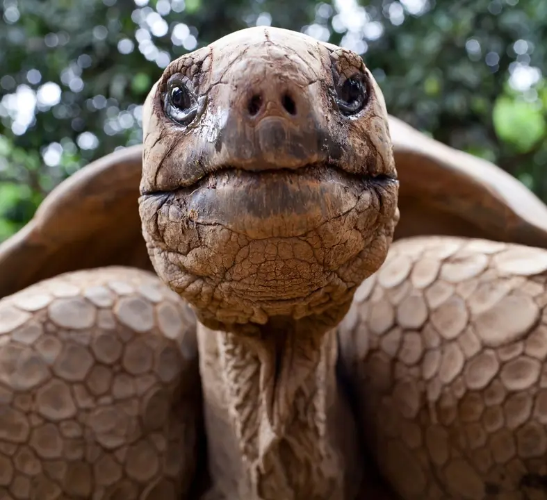

# Galapago

A Basic Computer Development Ecosystem

Each environment in the ecosystem is constrained to output one kind of artifact.

## Environments

### Environment 1: ***Woodboard***
	1. Ideation environment for note generation
	2. Output: text (.md)

### Environment 2: ***Seafoam***
	1. Artistic environment for image generation
	2. Output: image (.png)

### Environment 3: ***Tunafork***
	1. Musical environment for audio clip generation
	2. Output: audio (.mp3)

### Environment 4: ***Campfire***
	1. Cinematic environment for video clip generation
	2. Output: video (.mp4)

### Environment 5: ***Slidedeck***
	1. Professional work environment for report generation
	2. Output: report (.pdf)

### Environment 6: ***Logstore***
	1. Data querying environment for data pipeline generation
	2. Output: data (.sql)

### Environment 7: ***Bytestorm***
	1. Functional prototyping environment for software generation
	2. Output: code (.zip)

### Environment 8: ***Cerebella***
	1. Monitoring and scrutiny environment for deployment maintenance
	2. Output: app (.com)