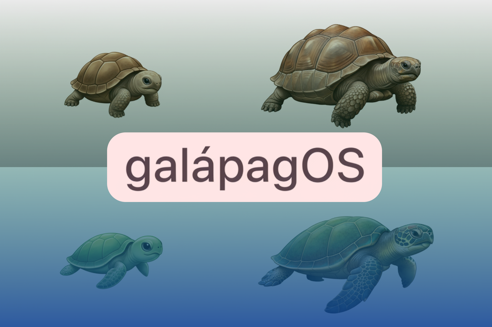

# galápagOS Home



The central hub for the galápagOS ecosystem - a launcher for all apps and a showroom for UI components.

## Purpose

This repository serves two main functions:

1. **App Launcher**: Click on app icons to access different environments in the galápagOS ecosystem
2. **UI Showroom**: Demonstrate and test the gOS UI components (panels, cards, collection browsers, etc.) on a single home page

## Ecosystem Apps

### ***Woodboard***
- Ideation environment for note generation
- Output: text (.md)

### ***Seafoam***
- Artistic environment for image generation
- Output: image (.png)

### ***Tunafork***
- Musical environment for audio clip generation
- Output: audio (.mp3)

### ***Campfire***
- Cinematic environment for video clip generation
- Output: video (.mp4)

### ***Slidedeck***
- Professional work environment for report generation
- Output: report (.pdf)

### ***Logstore***
- Data querying environment for data pipeline generation
- Output: data (.sql)

### ***Bytestorm***
- Functional prototyping environment for software generation
- Output: code (.zip)

### ***Cerebella***
- Monitoring and scrutiny environment for deployment maintenance
- Output: app (.com)

## UI Components

The platform provides reusable UI components that apps can use:

- **Panel**: Toggle-able drawer with resizer
- **Card**: Draggable and resizable canvas elements
- **Collection Browser**: Grid/list view for collections with drag & drop
- **Status Monitoring**: Real-time app health checking
- **DnD System**: Delegated drag sources and drop targets

## Getting Started

```bash
npm install
npm start
```

Visit `http://localhost:4000` to access the launcher and component showroom.
